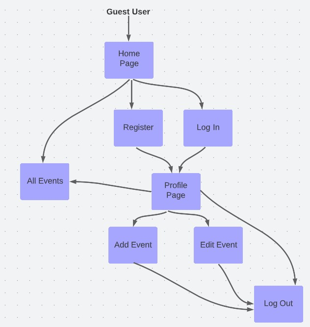
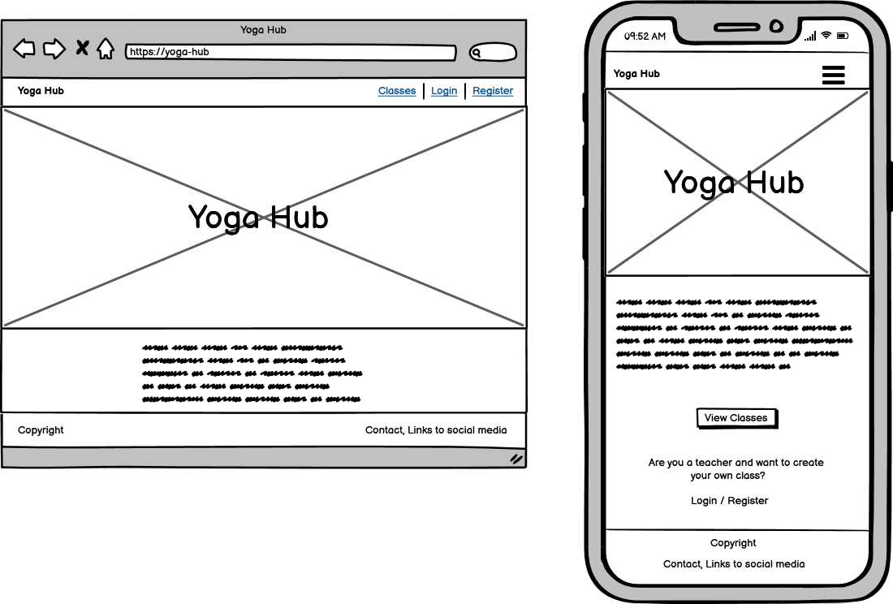
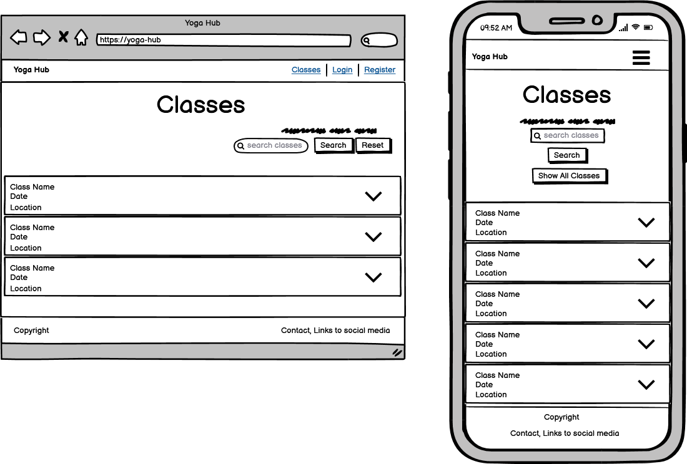
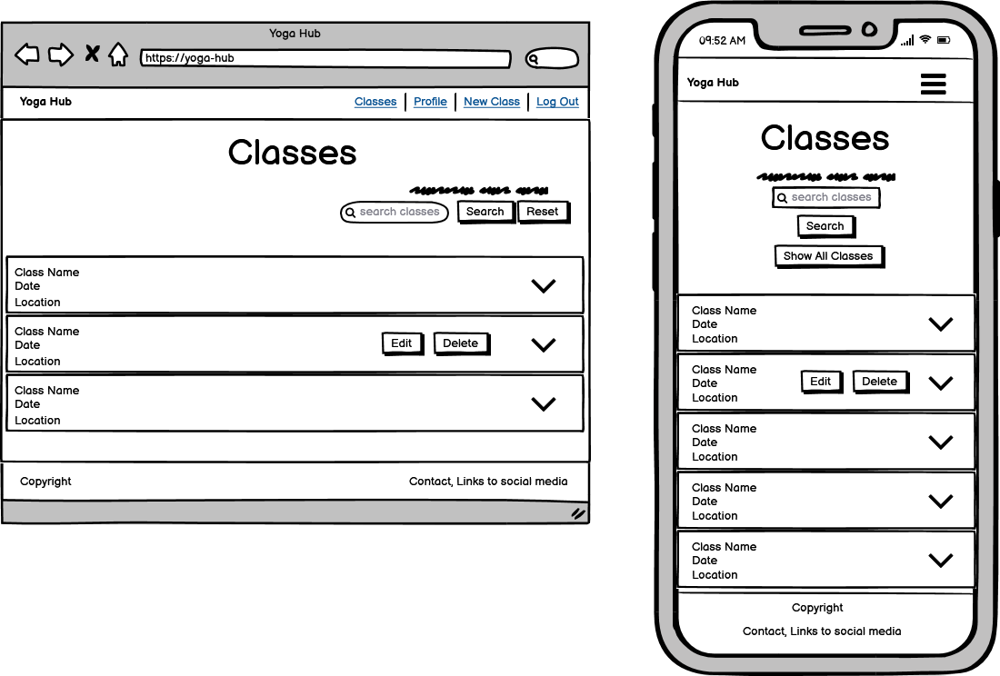
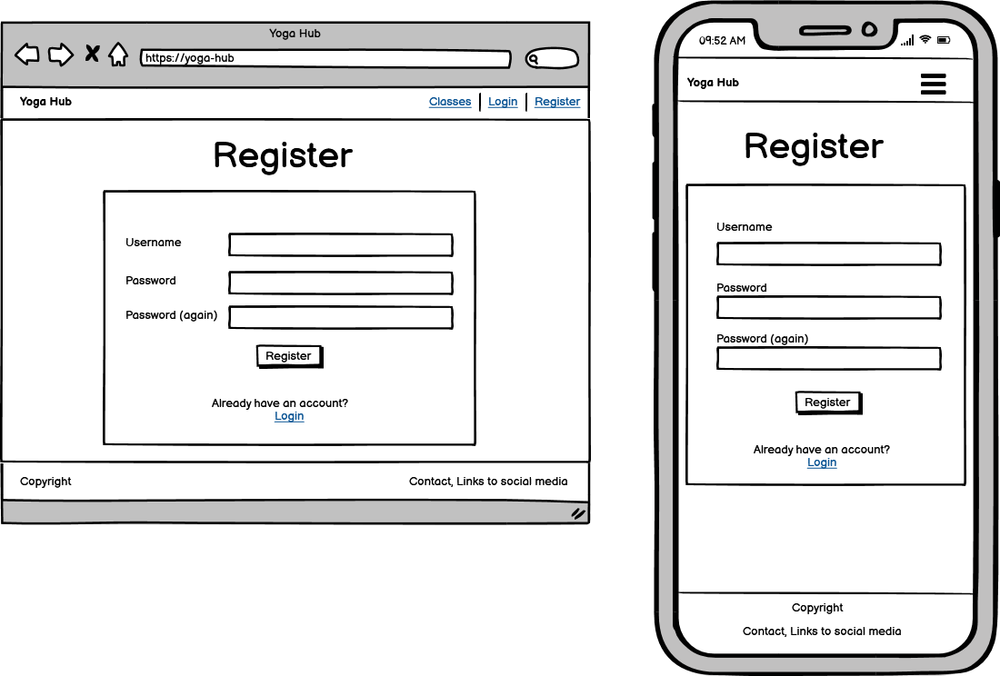
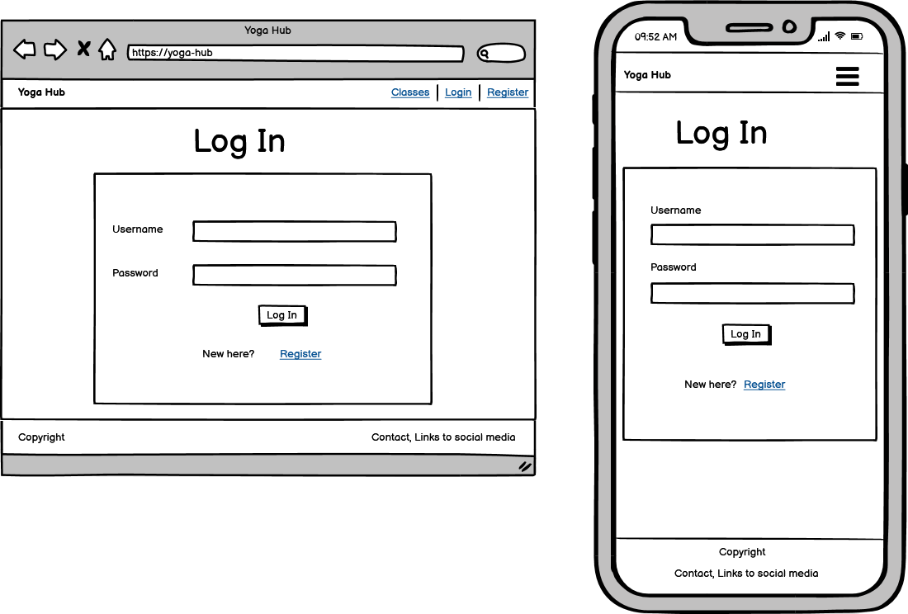
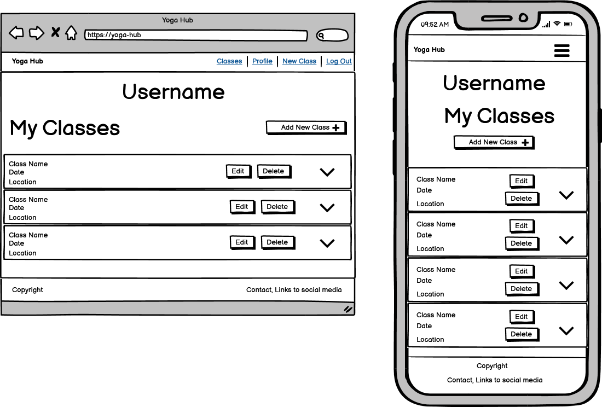
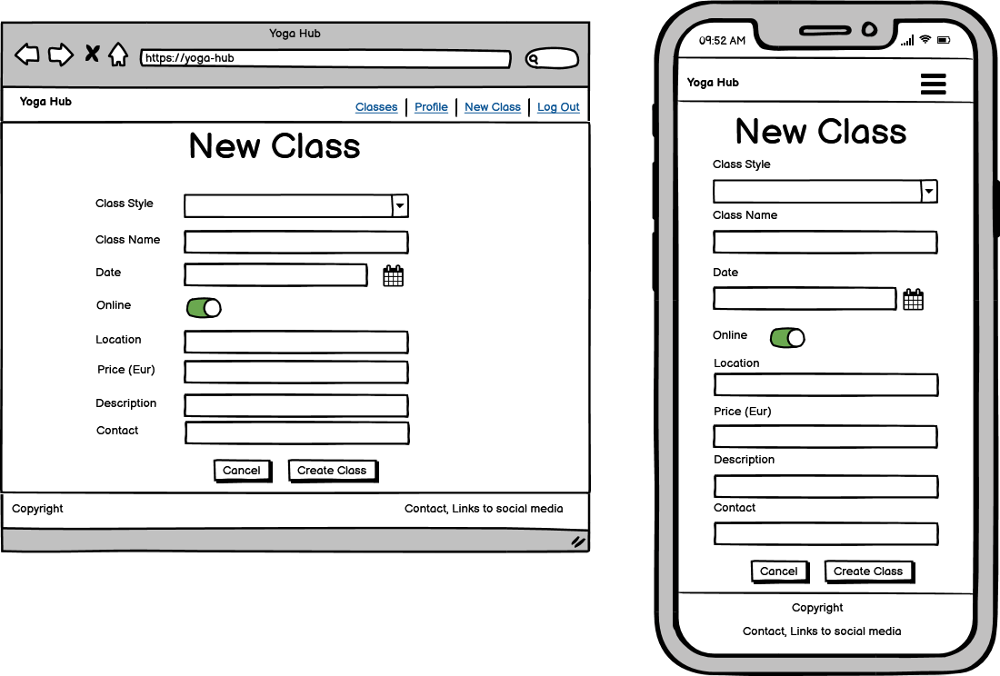
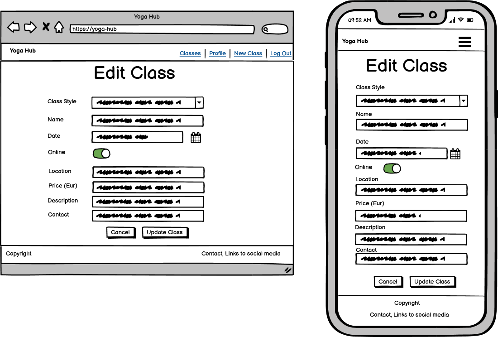
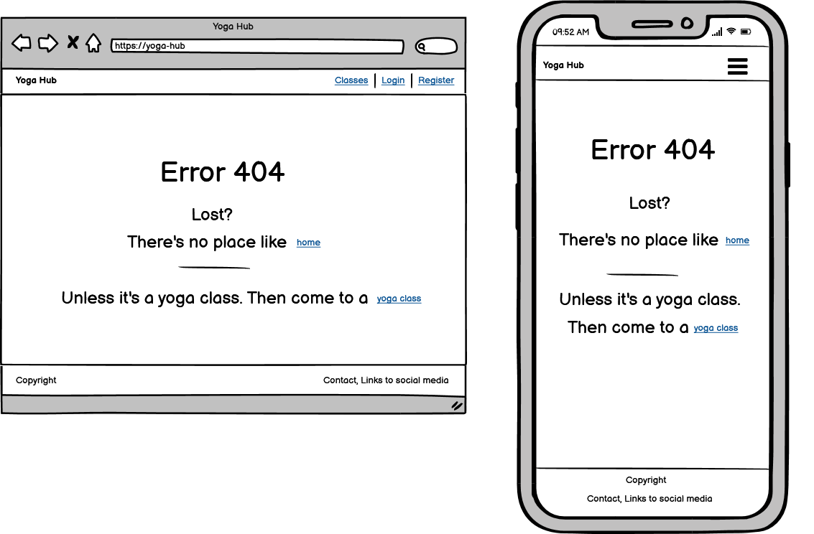

# Yoga Hub
_“You are only one yoga class away from a good mood.”_

The web application was built as my third milestone project for Code Institute's Full Stack Software Development course. It is a full-stack site that allows its users to store and manipulate data records about a yoga domain. The topic for the project was chosen because of my own yoga journey and those of my fellow yoga teachers in training. The app was designed with me/us using it in the future in mind. 

You can view the live website [here]( "Yoga Hub"). 
***
## User Experience (UX)

### Site Goals

* To provide a place for the yoga community (predominantly in Ireland) to come to to find classes being organised (online or in person) by various yoga teachers.
* To provide a place for yoga teachers to promote their own classes.

### User Stories

As a guest / not logged in user, I want to be able to:

* easily understand what the purpose of the website is.
* navigate the website easily, so that I can find any relevant content.
* view all classes posted on the website.
* find details of any class, as well as find out how to book the class I am interested in.
* search classes based on search terms of my choosing, so that I can find classes suited to me.
* contact the site administrator, so that I can ask any specific questions and get more information.
* view the website clearly on multiple devices, including my mobile device, so that I can achieve my other goals on the go.
* register on the website so that I can create and manage my own classes.

As a registered / logged in user, in addition to the above, I want to be able to:

* log into my account.
* view all classes created by me.
* add a new class.
* edit an existing class of mine.
* delete an existing class of mine.
* get visual feedback when an action on the site is completed.
* log out. 

### Planned Features

* Navigation menu on all pages - changes contents depending on user status
* Home page with information on the site purpose
* Classes displayed and searchable to all users
* User authentication (register, login, logout)
* Profile page listing the logged in user's classes
* CRUD functionality - class creation and management, limited to the class author
* 404 Error page navigating lost users back home
* Responsive design
* MongoDB to store information about users and classes

### User Journey

### Wireframes

* Home page

* Classes page

* Classes page for logged in user

* Register page

* Login page

* Profile page

* Add Class page

* Edit Class page

* 404 page

### Design

* #### Colour Scheme

* #### Typography

* #### Imagery

***
### Database Design

***
## Features

### Existing Features

### Features Left to Implement in the Future

***
## Technologies Used

### Languages Used

### Frameworks, Libraries & Programs Used

* [Balsamiq](https://balsamiq.com/wireframes/) - to create wireframes
* [Lucidchart](https://www.lucidchart.com/) - to create user journey (flowchart)

***
## Testing

### Validator Testing

### User Stories Testing

### Continuous Testing - Issues and Resolutions to issues found during testing

### Known Bugs and Issues

***
## Deployment

***
## Credits

### Code

### Content

### Media

### Acknowledgements

A big thank you to fellow Slackers from Code Institute's Slack channel for their support, advice, encouragement, and friendship.
