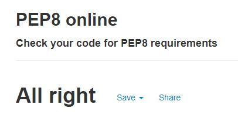

# Yoga Hub
_“You are only one yoga class away from a good mood.”_

The web application was built as my third milestone project for Code Institute's Full Stack Software Development course. It is a full-stack site that allows its users to store and manipulate data records about a yoga domain. The topic for the project was chosen because of my own yoga journey and those of my fellow yoga teachers in training. The app was designed with me/us using it in the future in mind. 


***
## User Experience (UX)

### Site Goals

* To provide a place for the yoga community (predominantly in Ireland) to come to to find classes being organised (online or in person) by various yoga teachers.
* To provide a place for yoga teachers to promote their own classes.

### User Stories

As a guest / not logged in user, I want to be able to:

* easily understand what the purpose of the website is.
* navigate the website easily, so that I can find any relevant content.
* view all classes posted on the website.
* find details of any class, as well as find out how to book the class I am interested in.
* search classes based on search terms of my choosing, so that I can find classes suited to me.
* contact the site administrator, so that I can ask any specific questions and get more information.
* view the website clearly on multiple devices, including my mobile device, so that I can achieve my other goals on the go.
* register on the website so that I can create and manage my own classes.

As a registered / logged in user, in addition to the above, I want to be able to:

* log into my account.
* view all classes created by me.
* add a new class.
* edit an existing class of mine.
* delete an existing class of mine.
* get visual feedback when an action on the site is completed.
* log out. 

### Planned Features

* Navigation menu on all pages - changes contents depending on user status
* Home page with information on the site purpose
* Classes displayed and searchable to all users
* User authentication (register, login, logout)
* Profile page listing the logged in user's classes
* CRUD functionality - class creation and management, limited to the class author
* 404 Error page navigating lost users back home
* Responsive design
* MongoDB to store information about users and classes

### User Journey


### Wireframes

* Home page


* Classes page


* Classes page for logged in user


* Register page


* Login page


* Profile page


* Add Class page


* Edit Class page


* 404 page


### Design

The site is designed with light theme in mind, characteristic for yoga studios and websites. 

* #### Colour Scheme
    The colour scheme is simple, using white background, and contrasting bright colors for most of its elements, including text. The scheme which served as an inspiration can be seen on [Coolors](https://coolors.co/b82677-a9d2cc-eb7545-f4f5f7-211f20).

* #### Typography
    Materilize's typography has been used throughout the site.

* #### Imagery
    Images of people in various yoga poses taking part in group classes have been used throughout the site to make the purpose of the website obvious and the site inspiring and esthetically pleasing.

***
## Notes on Development Process

* Trello Board has been used since the beginning of development to track progress, capture ideas, and make notes


* MaterializeCSS was chosen as a responsive CSS framework, mostly due to learning purposes, as I have been using Bootstrap extensively in the past and wanted to compare those two. I also liked the resulting look, as well as was aware of Materialize's shortcomings (especially it not being actively maintained).

* Changes to design - Originally, Materialize's Collapsible element was chosen to display individual classes. I then decided to showcase the classes a little bit more and create larger cards with the classes details on them, including an image.

* Changes to design - When sorting classes by date, a database date field of type Date was found to be easier to sort classes by. Originally, only a date field of type String was planned with. All the classes already existing in the database had this date manually edited by me, and every new / edited class has a parse function creating this field automatically.


***
## Database Design

MongoDB was used to store data for this site in a database. The data has been set out in three collections - classes, users, styles. See an example below: 

**Collection: styles**

{<br>
    "_id": unique value,<br>
    "class_style":"Hatha"<br>
}

**Collection: classes**

{<br>
    "_id": unique value,<br>
    "class_name":"Morning Vinyasa Flow with Susie",<br>
    "class_style":"Vinyasa",<br>
    "description":"Start the day Vinyasa style!",<br>
    "date":"30 June, 2022",<br>
    "is_online":"yes",<br>
    "location":"Zoom",<br>
    "price":"12",<br>
    "contact":"susie@susie.ie",<br>
    "created_by":"susie",<br>
    "date_parsed":{"$date":{"$numberLong":"1656547200000"}}<br>
}

**Collection: users**

{<br>
    "_id": unique value,<br>
    "username":"susie",<br>
    "password": unique value<br>
}

### Security

Database connection details are set up in an env.py for development, for security reasons this is not uploaded to GitHub so that database and connection details are not visible to users. In production these are stored in Heroku.

***
## Features

### Existing Features

* **Home Page**
    * Features a large hero image and text "Find Your Perfect Yoga Class" to help users understand the purpose of the website. 
    * There is a large button leading users to a page with collection of yoga classes.
    * A call to yoga teachers invites them to register on the website and post their classes for the community to attend.

* **Register functionality for teachers**
    * Asks users to create a unique username and enter their chosen password twice (the backend checks these two are matching).
    * User is then redirected to their profile page.

* **Login functionality for teachers**
    * Allows registered users to log in.
    * User is then redirected to their profile page.

* **Profile Page**
    * Filters classes by user and shows only classes created by the logged in user. 
    * Add New Class button is placed on the page.

* **Navigation**
    * Navigation responds to and updates with different links based on whether user is logged in or not.

* **Main Classes Page**
    * Displays all yoga classes hosted on the site. 

* **Search functionality**
    * A text based search is implemented on all the yoga classes. 
    * It takes an input from the user and searches the classes collection - specifically the class_name, description, and location fields.

* **Filter by yoga style functionality**
    * User can filter classes based on a yoga style of their choosing. This makes their classes lookup even easier.

* **Sorted by Date**
    * All yoga classes on the site are sorted by date in ascending order to make the lookup easier for the user.

* **Pagination**
    * Pagination is implemented on all pages (all classes display, search results, filtered results, collection of the logged in user's classes)

* **Add New Class**
    * Allows user to create a new class by filling in all the required fields.
    * There is front end as well as back end **validation** implemented on all the input fields. It also gives user a feedback in real time.

* **Ability to Edit Class**
    * User has the ability to edit only the classes they created themselves.
    * **Validation** is implemented on all the input fields.

* **Ability to Delete Class**
    * User can delete only the classes they created themselves.

* **Defensive programming**
    * Confirmation of deletion request. Prompts user to confirm deletion of a class.
    * User cannot access another user's profile page or details by typing in URL with their username. If they try, they are redirected to the login page.

* **Footer**
    * Contains copyright information, as well as links to the admin's (website creator's) GitHub and LinkedIn pages.

* **Custom 404 and 500 Error Pages**
    * To handle internal and not_found errors gracefully. 

* **Favicon**

* **The site is fully responsive**

### Features Left to Implement in the Future

* Create two types of users - teachers and regular users. (At the moment, there is no need for this.)
* Allow regular users to save events for themselves, so that they can access them easier in the future. Display these saved classes on their profile page.
* Further filters based on location, live/online events, teacher.
* Option for teachers to create a repeat event.
* User verification - to check that all logged in users (teachers) are accredited yoga teachers.
* Ability to select various tags on classes - e.g. outdoor, indoor, online, Zoom, Hatha.. - for easier search and also to make the content of the classes more visually obvious to users.
* Various images showcasing different styles of yoga implemented on the classes cards.
* Visual calendar with classes on.
* FAQ.
* Online booking.
* Online payment.

***
## Technologies Used

### Languages Used

* HTML5
* CSS3
* JavaScript
* Python3

### Frameworks, Libraries & Programs Used

* [Heroku](https://heroku.com/) - to deploy the live site
* [MongoDB](https://www.mongodb.com/) - to host the database
* [Flask](https://flask.palletsprojects.com/en/2.1.x/) - micro web framework written in Python
* [Flask-PyMongo](https://pypi.org/project/Flask-PyMongo/) - to connect the app to MongoDB
* [Jinja](https://jinja.palletsprojects.com/en/3.0.x/) - extensible templating engine 
* [Werkzeug](https://werkzeug.palletsprojects.com/en/2.1.x/) - WSGI web application library
* [pip](https://pip.pypa.io/en/stable/) - to install dependencies for the site
* [dnspython](https://www.dnspython.org/) - DNS toolkit for Python
* [Git](https://git-scm.com/) - version control
* [GitHub](https://github.com/) - to store the code for this project
* [GitPod](https://www.gitpod.io/) - virtual IDE used to build this site
* [Materialize](https://materializecss.com/) - a responsive front-end framework based on Material Design
* [Font Awesome](https://fontawesome.com/) - to add icons to the site
* [jQuery](https://jquery.com/) - JavaScript library
* [Google DevTools](https://developer.chrome.com/docs/devtools/)
* [Balsamiq](https://balsamiq.com/wireframes/) - to create wireframes
* [Lucidchart](https://www.lucidchart.com/) - to create user journey (flowchart)
* [Trello](https://www.trello.com/) - to project manage, Kanban-style
* [https://imagecompressor.com/](https://imagecompressor.com/) - to compress image files
* [https://favicon.io/](https://favicon.io/favicon-converter/) - to generate favicon
* [amiresponsive](https://ui.dev/amiresponsive?url=https://yoga-hub.herokuapp.com/home)

***
## Testing

* Validator Testing
* Page quality measurement / Performance
* User Stories Testing
* Manual Testing
* Error Testing
* Continuous Testing

### Validator Testing

#### HTML

All pages were checked using [W3C Markup Validation Service](https://validator.w3.org/).

The HTML code was validated using the page URL to avoid false error flags due to Jinja.

There was one warning showing on all pages, which was related to flashed messages. Once the pages were tested while the flashed message was displaying, the warning disappeared. 


All pages are passing all checks.

#### CSS

The CSS file was checked using [W3C CSS Markup Validation Service](https://jigsaw.w3.org/css-validator/).

One error was found, caused by transition property missing an 's'. This was corrected and the CSS file is now passing the check.


#### JavaScript

[JSHint](https://jshint.com/) was used to check the script.js file. 
An error showing "jquery not defined" was fixed by checking / enabling jQuery in the Configuration part, under the "Assume" section.
A warning "	'let' is available in ES6 (use 'esversion: 6') or Mozilla JS extensions (use moz)" was also fixed by marking "New JavaScript features (ES6)" in the same "Assume" section.

There JavaScript is now passing this validator. 


#### Python

The appy.py file was checked using [PEP8 online](http://pep8online.com/) validator.
There was an error "continuation line with same indent as next logical line" found caused by an indentation mistake. I have learned that continuation lines should not be indented at the same level as the next logical line. 


The Python code now fully conforms to the PEP8 style guide.




### Page quality measurement by [web.dev](https://web.dev/measure/)


I was overall happy with these results. Heroku delivery is causing the biggest delay on page load, but the next suggested opportunity was to "Consider delivering critical JS/CSS inline and deferring all non-critical JS/styles."


### User Stories Testing

**As a guest / not logged in user, I want to be able to:**

* **easily understand what the purpose of the website is.**
    * Everything is clearly laid out.
    * Hero image shows people in yoga class.
    * Icons are used to help convey meaning.
    * All buttons describe what they're for in simple terms.

    

* **navigate the website easily, so that I can find any relevant content.**
    * The navigation bar is clearly visible on all pages.
    * Every page contains buttons leading user to further actions and navigating them back by providing 'Cancel' buttons.

* **view all classes posted on the website.**
    * All classes are displayed on the homepage for all users to view.

    

* **find details of any class, as well as find out how to book the class I am interested in.**
    * All classes are displayed on the homepage for all users to view.
    * All classes have all their details showing on them.
    * There are contact details for all the teachers to be contacted on.

    

* **search classes based on search terms of my choosing, so that I can find classes suited to me.**
    * The search bar is displayed prominently on the homepage for all users, whether logged in or not.
    * The search provides correct results.

    

* **contact the site administrator, so that I can ask any specific questions and get more information.**
    * There are links to both GitHub and LinkedIn pages of the site administrator in the footer, as is a standard practice.

    

* **view the website clearly on multiple devices, including my mobile device, so that I can achieve my other goals on the go.**
    * Website is fully responsive and is easy to view and navigate on all devices.

    

* **register on the website so that I can create and manage my own classes.**
    * The register link is clear to see on the navigation bar and there is also a Register button on the landing page.
    * It only requires a username, a password, and a confirmation of that password to register an account.

    

**As a registered / logged in user, in addition to the above, I want to be able to:**

* **log into my account.**
    * The log in link is visible in the navigation bar.
    * It only requires user's username and password to fill in and the user is then brought to their profile page.

    

* **view all classes created by me.**
    * All classes created by the user are displayed on the profile page of the logged in user.

    

* **add a new class.**
    * The 'Add Class' button is available on the navigation bar once user logs in.
    * There is an 'Add Class' button available on the profile page of the logged in user as well. 
    * Every input field on the Add New Class form is clearly defined.
    * Icons provide additional meaning.

    

* **edit an existing class of mine.**
    * All the classes of the logged in user are displayed on their profile page.
    * Each class has its own Edit button.
    * There is an edit page which is prefilled with all the fields for an ease of editing.

    

* **delete an existing class of mine.**
    * All the classes of the logged in user are displayed on their profile page.
    * Each class has its own Delete button.

    
    

* **get visual feedback when an action on the site is completed.**
    * A flash message appears at the top of the screen when any class is added, edited, deleted; when user registers, logs in, logs out.
    
    

* **log out.**
    * The log out link is visible in the navigation bar.

    


### Manual Testing

#### base.html

| Element               | Action        | Expected Result| Pass/Fail  |
|:-------------         |:------------- |:-----|:-----|
| **NavBar**            |               |      |
|Brand Logo             |Click|Redirect to home         |Pass|
|Classes Link           |Click|Redirect to all classes  |Pass|
|Profile Link           |Click|Redirect to profile page|Pass|
|                       |     |(Not visible if user not in session)  |Pass|
|Add Class Link         |Click|Redirect to add class page|Pass|
|                       |     |(Not visible if user not in session)  |Pass|
|Register Link          |Click|Redirect to register page|Pass|
|                       |     |(Not visible if user in session)  |Pass|
|Log In Link            |Click|Redirect to log in page  |Pass|
|                       |     |(Not visible if user in session)  |Pass|
|Log Out Link           |Click|Log user out of account  |Pass|
|                       |Click|Redirect to log in page  |Pass|
|                       |     |(Only visible if user in session)  |Pass|
| **SideNav**           |       |    |
|Hamburger Icon         |Click|Open Sidenav             |Pass|
|Classes Link           |Click|Redirect to all classes  |Pass|
|Profile Link           |Click|Redirect to profile page|Pass|
|                       |     |(Not visible if user not in session)  |Pass|
|Add Class Link         |Click|Redirect to add class page|Pass|
|                       |     |(Not visible if user not in session)  |Pass|
|Register Link          |Click|Redirect to register page|Pass|
|                       |     |(Not visible if user in session)  |Pass|
|Log In Link            |Click|Redirect to log in page  |Pass|
|                       |     |(Not visible if user in session)  |Pass|
|Log Out Link           |Click|Log user out of account  |Pass|
|                       |Click|Redirect to log in page  |Pass|
|                       |     |(Only visible if user in session)  |Pass|
| **Footer**            |     |     |
|GitHub Link          |Click|Open on external page    |Pass|
|LinkedIn Link         |Click|Open on external page    |Pass|

---
### **index.html**
| Element               | Action            | Expected Result           | Pass/Fail  |
|:-------------         |:-------------     |:-----                     |:-----|
| **Home page**         |                   |                           |    |
|Classes Link           |Click              |Redirect to classes page   |Pass|
|Register Link          |Click              |Redirect to register page  |Pass|

---

### **profile.html**

| Element                   | Action            | Expected Result                   | Pass/Fail  |
|:-------------             |:-------------     |:-----                             |:-----|
| **Add New Class Btn**     |                   |                                   |    |
|Add New Class Button       |Click              |Redirect to add new class page     |Pass|
| **Class Card**            |                   |                                   |    |
|Class Card                 |Click              |Reveal more class details          |Pass|
|Tooltips                   |Hover              |Reveal notes/instructions          |Pass|
|Edit class button          |Click              |Redirect to edit class page        |Pass|
|Delete class button        |Click              |Open delete confirmation modal     |Pass|
|Delete modal - delete btn  |Click              |Delete selected class             |Pass|
|                           |                   |Redirect to account page           |Pass|
|                           |                   |'Class deleted' confirmation message |Pass|
|Delete modal - cancel btn  |Click              |Close modal with no change made    |Pass|
| **Pagination**            |                   |                                   |    |
|<< btn                     |Click              |Reveal 'previous' classes page     |Pass|
|Pagination number          |Click              |Specific classes page number       |Pass|
|>> btn                     |Click              |Reveal 'next' classes              |Pass|

---
### add_class.html

| Element                   | Action            | Expected Result                   | Pass/Fail  |
|:-------------             |:-------------     |:-----                             |:-----|
| **Form**                  |                   |                                   |    |
|Choose Class Style dropdown|Click              |Reveal style options               |Pass|
|Text input fields          |Type into          |Text appears, line highlights green|Pass|
|Text input fields          |Leave blank        |Line highlights red                |Pass|
|Text input fields          |Just input whitespace  |Line highlights red            |Pass|
|Add class btn(all fields correct)|Click       |Class uploads to database         |Pass|
|                           |                   |Redirect to profile page           |Pass|
|                           |                   |"Class Added Successfully" confirmation message|Pass|
|Add class btn(some incorrect fields)|Click    |Page scrolls to incorrect fields   |Pass|
|Cancel btn                 |Click              |No changes made to class          |Pass|
|                           |                   |Redirect to profile page           |Pass|

---
### edit_class.html

| Element                   | Action            | Expected Result                   | Pass/Fail  |
|:-------------             |:-------------     |:-----                             |:-----|
| **Form**                  |                   |                                   |    |
|Choose Class Style dropdown|Click              |Reveal style options               |Pass|
|Text input fields          |Type into          |Text appears, line highlights green|Pass|
|Text input fields          |Leave blank        |Line highlights red                |Pass|
|Text input fields          |Just input whitespace  |Line highlights red            |Pass|
|Edit class btn(all fields correct)|Click       |Class uploads to database         |Pass|
|                           |                   |Redirect to profile page           |Pass|
|                           |                   |"Class Added Successfully" confirmation message|Pass|
|Edit class btn(some incorrect fields)|Click    |Page scrolls to incorrect fields   |Pass|
|Cancel btn                 |Click              |No changes made to class          |Pass|
|                           |                   |Redirect to profile page           |Pass|

---
### **classes.html**

| Element                   | Action            | Expected Result                   | Pass/Fail  |
|:-------------             |:-------------     |:-----                             |:-----|
|**Search**                 |                   |                                   |    |
|Text input                 |Text input         |Text displayed to user             |Pass|
|Search btn (with results)  |Click              |Display matched classes to user    |Pass|
|Search btn (no results)    |Click              |'No Results Found' message         |Pass|
|Filter btn (with results)  |Click              |Display matched classes to user    |Pass|
|Filter btn (no results)    |Click              |'No Results Found' message         |Pass|
|Reset btns                 |Click              |Clear search, show all classes     |Pass|
| **Class Card**            |                   |                                   |    |
|Class Card                 |Click              |Reveal class action buttons        |Pass|
| **Pagination**            |                   |                                   |    |
|<< btn                     |Click              |Reveal 'previous' classes          |Pass|
|Pagination number          |Click              |Specific classes page number       |Pass|
|>> btn                     |Click              |Reveal 'next' classes              |Pass|

---
### **register.html**

| Element                   | Action            | Expected Result                   | Pass/Fail  |
|:-------------             |:-------------     |:-----                             |:-----|
|**Form**                   |Click              |Redirect to previous page          |Pass|
|Username                   |Text input         |Text displayed to user             |Pass|
|Password                   |Text input         |Password hidden to user            |Pass|
|Password                   |Text input         |Password hidden to user            |Pass|
|**Submit btn**             |                   |                                   |    |
|Fields correct             |Click              |New user added to database         |Pass|
|                           |                   |Redirect to profile page           |Pass|
|Fields incorrect format    |Click              |Fields highlighted red, user prompted to change format |Pass|
|Username already in use    |Click              |Reload register page, error message to user    |Pass|
|**Redirect Link**          ||||
|'Log in here' link         |Click              |Redirect to log in page            |Pass|

---
### **login.html**

| Element                   | Action            | Expected Result                   | Pass/Fail  |
|:-------------             |:-------------     |:-----                             |:-----|
|**Form**                   |Click              |Redirect to previous page          |Pass|
|Username                   |Text input         |Text displayed to user             |Pass|
|Password                   |Text input         |Password hidden to user            |Pass|
|Submit btn (fields correct)|Click              |Redirect to profile page           |Pass|
|Submit btn (fields incorrect)|Click            |Reload log in page                 |Pass|
|**Redirect Link**          |                   |                                   |    |
|'Register here' link       |Click              |Redirect to registration page      |Pass|


### Error Testing

    * 404 Error message can be tested by typing https://yoga-hub.herokuapp.com/nonsense into the address bar. The result: 

    

        * test links lead to Home page and the second one to Classes page - PASS

### Continuous Testing - Issues and Resolutions to issues found during testing

During the development process, the application was continuously tested and bugs and issues that were found were resolved. A few examples:

* When a logged in user typed in url address looking to get to another user's profile, or the username in the typed url did not exist / user was deleted, they were still sent to their profile page (see the screenshot below). If the user was not logged in and typed a url aiming to get to a profile page, an internal server error was triggered. This was corrected by checking whether the username from the url exists, and whether it matches the username of the logged in user. The user was then redirected appropriately. See example of bug showing username in url not matching logged in user's username below:


* When filter search was performed on all classes, the correct results were displayed on the page. If the results were paginated however, following the pagination to second page of filtered results resulted in the classes page reverting back to second paginated page of all classes (instead of remembering the filter query). This was fixed by checking whether the args contained the word 'page'. If they did not, then the query parameter 'style' was used instead.

* The above fix however caused another problem with pagination links not updating correctly and therefore displaying wrong results / visually not being correct when text search was performed, and user has navigated to second page of the search results (see screenshot). 

This was fixed with custom JavaScript code which updates innerText of the pagination links. 

* Materialize caused a number of issues with visual and frequently had to be overwritten completely. 


### Known Bugs and Issues

There are currently no known bugs or issues present.

***
## Deployment

### Requirements for Deployment

* GitHub account
* Python
* MongoDB account
* Heroku account

### Heroku Deployment

This project was deployed on Heroku following these steps:

#### Requirements.txt and Procfile

Create these files using these steps in (GitPod) terminal:

1. Type `pip3 freeze -–local > requirements.txt` to create a requirements file (it keeps track of the Python dependencies that we've installed for our project)
2. Type `echo web: python3 run.py > Procfile` to create Procfile (a Heroku-specific type of file that tells Heroku how to run our project)
3. Delete any additional empty lines after the line `web: python app.py`
4. Push these two files into your depository

#### Environment Variables

Create an env.py file with the following information: 

```
import os

os.environ.setdefault("IP", "0.0.0.0")
os.environ.setdefault("PORT", "5000")
os.environ.setdefault("SECRET_KEY", " unique secret key")
os.environ.setdefault("MONGO_URI", " unique uri from mongodb ")
os.environ.setdefault("MONGO_DBNAME", " database name ")
```

As this file contains sensitive information, it needs to be added to the .gitignore file to not be pushed to GitHub

#### Create Heroku App

1. Log in to Heroku
2. Select 'Create New App' from the dashboard
3. Choose an app name (each name has to be unique, if app with that name exists already, a different name will have to be chosen)
4. Select the region based on your location
5. Click 'Create App'
6. Add config vars to Heroku - go to Heroku Settings tab, click on Reveal Config Vars, enter your above described environment variables
7. In your CLI install Heroku by typing `npm install -g heroku`

#### Deploying our App to Heroku

1. Login to Heroku by typing `heroku login -i`
2. Get your app name from Heroku by typing command `heroku apps`
3. Set the Heroku remote (replace the <app_name> with your actual app name): `heroku git:remote -a <app_name>`
4. Add, commit, and push to GitHub (commands `git add .` & `git commit -m "Deploy to Heroku via CLI"`)
5. Push to GitHub `git push origin main`
6. Push to Heroku `git push heroku main`
7. Your Heroku app will be built and you will see your deployed app's URL

### Forking the Repository

This project can be forked following these steps: 

1. Log in to GitHub and locate this project (you are most likely here). 
2. Locate the Fork button at the top right corner of the page and click on it. 
3. A copy of the original repository is in your GitHub account

### Local Clone

1. Navigate to this GitHub repository (you are most likely here)
2. Click on the Code dropdown
3. Copy the URL of the repository in the HTTPS tab
4. Use your IDE of choice to open its terminal
5. Change the current working directory to the location where you want the cloned directory
6. Type `git clone` and then paste the previously copied URL
7. Press enter to create your local clone
8. Create the above described env.py file with your own values
9. You will also need to create a MongoDB database matching the one described above
10. Install the project requirements by using the command `pip3 install -r requirements.txt`
11. Type `python3 app.py` in your terminal to run the program

***
## Credits

### Code

* project is based on and developed from [Code Institute](https://codeinstitute.net/)'s walkthrough Flask Task Manager
* [Materialize documentation](https://materializecss.com/) with code snippets
* [Materialize on GitHub](https://github.com/Dogfalo/materialize)
* [MongoDB documentation](https://www.mongodb.com/docs/)
* [demo for how to use flask-paginate](https://gist.github.com/mozillazg/69fb40067ae6d80386e10e105e6803c9)

### Content

Content written by Monika Hrda.

### Media

* all yoga related images sourced from [Pexels](https://www.pexels.com/)
* image used as favicon found on [PxHere](https://pxhere.com/)

### Acknowledgements

A big thank you to fellow Slackers from Code Institute's Slack channel for their support, advice, encouragement, and friendship.
