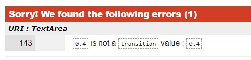
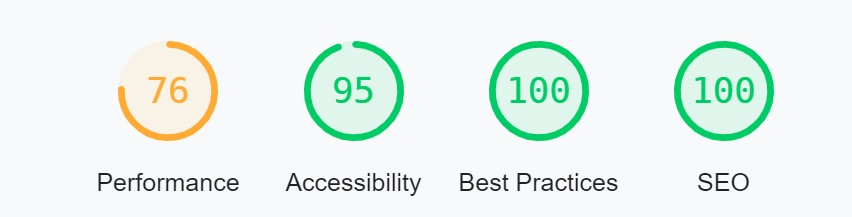
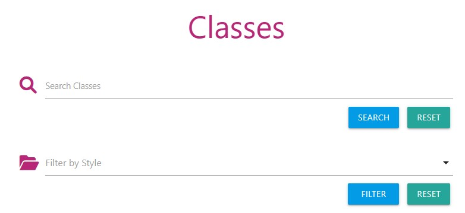
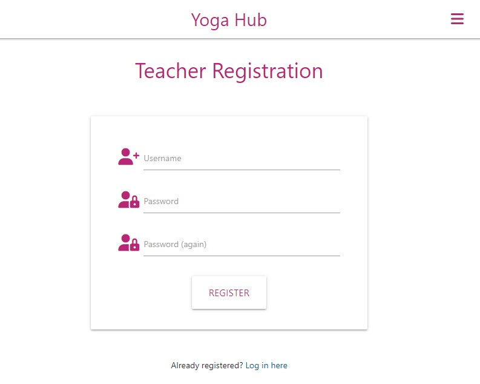
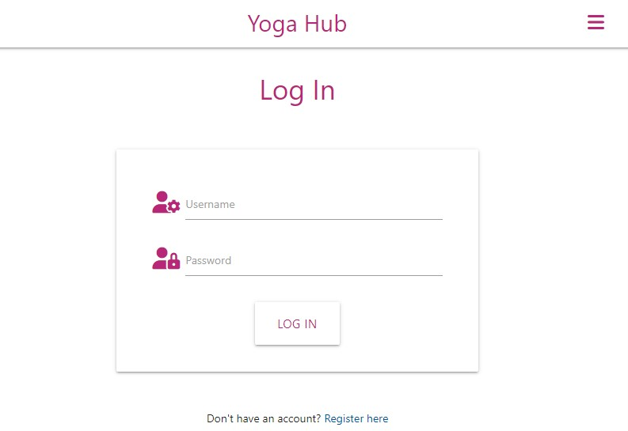
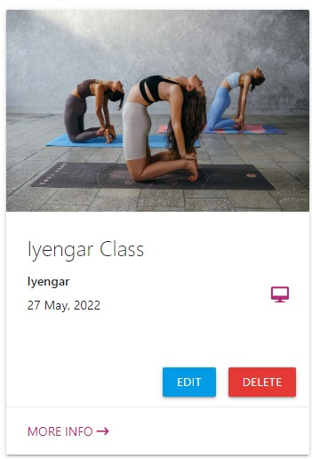
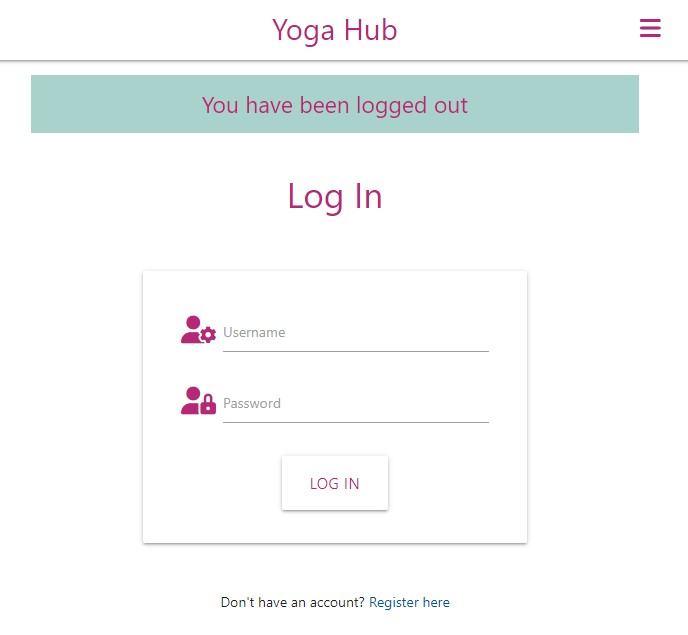
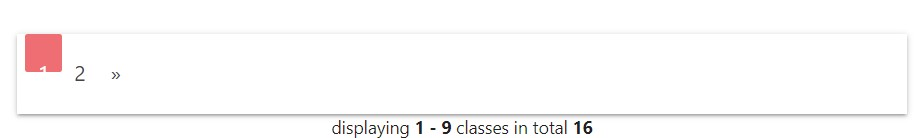

Go back to [README.md](https://github.com/monika-hrda/yoga-hub/blob/main/README.md)

## Testing

* Validator Testing
* Page quality measurement / Performance
* User Stories Testing
* Manual Testing
* Error Testing
* Continuous Testing

### Validator Testing

#### HTML

All pages were checked using [W3C Markup Validation Service](https://validator.w3.org/).

The HTML code was validated using the page URL to avoid false error flags due to Jinja.

There was one warning showing on all pages, which was related to flashed messages. Once the pages were tested while the flashed message was displaying, the warning disappeared. 

All pages are passing all checks.

#### CSS

The CSS file was checked using [W3C CSS Markup Validation Service](https://jigsaw.w3.org/css-validator/).

One error was found, caused by transition property missing an 's'. This was corrected and the CSS file is now passing the check.

#### JavaScript

[JSHint](https://jshint.com/) was used to check the script.js file. 
An error showing "jquery not defined" was fixed by checking / enabling jQuery in the Configuration part, under the "Assume" section.
A warning "	'let' is available in ES6 (use 'esversion: 6') or Mozilla JS extensions (use moz)" was also fixed by marking "New JavaScript features (ES6)" in the same "Assume" section.

There JavaScript is now passing this validator. 

#### Python

The appy.py file was checked using [PEP8 online](http://pep8online.com/) validator.
There was an error "continuation line with same indent as next logical line" found caused by an indentation mistake. I have learned that continuation lines should not be indented at the same level as the next logical line. 

The Python code now fully conforms to the PEP8 style guide.

### Page quality measurement by [web.dev](https://web.dev/measure/)

I was overall happy with these results. Heroku delivery is causing the biggest delay on page load, but the next suggested opportunity was to "Consider delivering critical JS/CSS inline and deferring all non-critical JS/styles."

### User Stories Testing

**As a guest / not logged in user, I want to be able to:**

* **easily understand what the purpose of the website is.**
    * Everything is clearly laid out.
    * Hero image shows people in yoga class.
    * Icons are used to help convey meaning.
    * All buttons describe what they're for in simple terms.

    

* **navigate the website easily, so that I can find any relevant content.**
    * The navigation bar is clearly visible on all pages.
    * Every page contains buttons leading user to further actions and navigating them back by providing 'Cancel' buttons.

* **view all classes posted on the website.**
    * All classes are displayed on the homepage for all users to view.

    

* **find details of any class, as well as find out how to book the class I am interested in.**
    * All classes are displayed on the homepage for all users to view.
    * All classes have all their details showing on them.
    * There are contact details for all the teachers to be contacted on.

    

* **search classes based on search terms of my choosing, so that I can find classes suited to me.**
    * The search bar is displayed prominently on the homepage for all users, whether logged in or not.
    * The search provides correct results.

    

* **contact the site administrator, so that I can ask any specific questions and get more information.**
    * There are links to both GitHub and LinkedIn pages of the site administrator in the footer, as is a standard practice.

    

* **view the website clearly on multiple devices, including my mobile device, so that I can achieve my other goals on the go.**
    * Website is fully responsive and is easy to view and navigate on all devices.

    

* **register on the website so that I can create and manage my own classes.**
    * The register link is clear to see on the navigation bar and there is also a Register button on the landing page.
    * It only requires a username, a password, and a confirmation of that password to register an account.

    

**As a registered / logged in user, in addition to the above, I want to be able to:**

* **log into my account.**
    * The log in link is visible in the navigation bar.
    * It only requires user's username and password to fill in and the user is then brought to their profile page.

    

* **view all classes created by me.**
    * All classes created by the user are displayed on the profile page of the logged in user.

    

* **add a new class.**
    * The 'Add Class' button is available on the navigation bar once user logs in.
    * There is an 'Add Class' button available on the profile page of the logged in user as well. 
    * Every input field on the Add New Class form is clearly defined.
    * Icons provide additional meaning.

    

* **edit an existing class of mine.**
    * All the classes of the logged in user are displayed on their profile page.
    * Each class has its own Edit button.
    * There is an edit page which is prefilled with all the fields for an ease of editing.

    

* **delete an existing class of mine.**
    * All the classes of the logged in user are displayed on their profile page.
    * Each class has its own Delete button.

    
    

* **get visual feedback when an action on the site is completed.**
    * A flash message appears at the top of the screen when any class is added, edited, deleted; when user registers, logs in, logs out.
    
    

* **log out.**
    * The log out link is visible in the navigation bar.

    

### Manual Testing

#### base.html

| Element               | Action        | Expected Result| Pass/Fail  |
|:-------------         |:------------- |:-----|:-----|
| **NavBar**            |               |      |
|Brand Logo             |Click|Redirect to home         |Pass|
|Classes Link           |Click|Redirect to all classes  |Pass|
|Profile Link           |Click|Redirect to profile page|Pass|
|                       |     |(Not visible if user not in session)  |Pass|
|Add Class Link         |Click|Redirect to add class page|Pass|
|                       |     |(Not visible if user not in session)  |Pass|
|Register Link          |Click|Redirect to register page|Pass|
|                       |     |(Not visible if user in session)  |Pass|
|Log In Link            |Click|Redirect to log in page  |Pass|
|                       |     |(Not visible if user in session)  |Pass|
|Log Out Link           |Click|Log user out of account  |Pass|
|                       |Click|Redirect to log in page  |Pass|
|                       |     |(Only visible if user in session)  |Pass|
| **SideNav**           |       |    |
|Hamburger Icon         |Click|Open Sidenav             |Pass|
|Classes Link           |Click|Redirect to all classes  |Pass|
|Profile Link           |Click|Redirect to profile page|Pass|
|                       |     |(Not visible if user not in session)  |Pass|
|Add Class Link         |Click|Redirect to add class page|Pass|
|                       |     |(Not visible if user not in session)  |Pass|
|Register Link          |Click|Redirect to register page|Pass|
|                       |     |(Not visible if user in session)  |Pass|
|Log In Link            |Click|Redirect to log in page  |Pass|
|                       |     |(Not visible if user in session)  |Pass|
|Log Out Link           |Click|Log user out of account  |Pass|
|                       |Click|Redirect to log in page  |Pass|
|                       |     |(Only visible if user in session)  |Pass|
| **Footer**            |     |     |
|GitHub Link          |Click|Open on external page    |Pass|
|LinkedIn Link         |Click|Open on external page    |Pass|

---
### **index.html**
| Element               | Action            | Expected Result           | Pass/Fail  |
|:-------------         |:-------------     |:-----                     |:-----|
| **Home page**         |                   |                           |    |
|Classes Link           |Click              |Redirect to classes page   |Pass|
|Register Link          |Click              |Redirect to register page  |Pass|

---

### **profile.html**

| Element                   | Action            | Expected Result                   | Pass/Fail  |
|:-------------             |:-------------     |:-----                             |:-----|
| **Add New Class Btn**     |                   |                                   |    |
|Add New Class Button       |Click              |Redirect to add new class page     |Pass|
| **Class Card**            |                   |                                   |    |
|Class Card                 |Click              |Reveal more class details          |Pass|
|Tooltips                   |Hover              |Reveal notes/instructions          |Pass|
|Edit class button          |Click              |Redirect to edit class page        |Pass|
|Delete class button        |Click              |Open delete confirmation modal     |Pass|
|Delete modal - delete btn  |Click              |Delete selected class             |Pass|
|                           |                   |Redirect to account page           |Pass|
|                           |                   |'Class deleted' confirmation message |Pass|
|Delete modal - cancel btn  |Click              |Close modal with no change made    |Pass|
| **Pagination**            |                   |                                   |    |
|<< btn                     |Click              |Reveal 'previous' classes page     |Pass|
|Pagination number          |Click              |Specific classes page number       |Pass|
|>> btn                     |Click              |Reveal 'next' classes              |Pass|

---
### add_class.html

| Element                   | Action            | Expected Result                   | Pass/Fail  |
|:-------------             |:-------------     |:-----                             |:-----|
| **Form**                  |                   |                                   |    |
|Choose Class Style dropdown|Click              |Reveal style options               |Pass|
|Text input fields          |Type into          |Text appears, line highlights green|Pass|
|Text input fields          |Leave blank        |Line highlights red                |Pass|
|Text input fields          |Just input whitespace  |Line highlights red            |Pass|
|Add class btn(all fields correct)|Click       |Class uploads to database         |Pass|
|                           |                   |Redirect to profile page           |Pass|
|                           |                   |"Class Added Successfully" confirmation message|Pass|
|Add class btn(some incorrect fields)|Click    |Page scrolls to incorrect fields   |Pass|
|Cancel btn                 |Click              |No changes made to class          |Pass|
|                           |                   |Redirect to profile page           |Pass|

---
### edit_class.html

| Element                   | Action            | Expected Result                   | Pass/Fail  |
|:-------------             |:-------------     |:-----                             |:-----|
| **Form**                  |                   |                                   |    |
|Choose Class Style dropdown|Click              |Reveal style options               |Pass|
|Text input fields          |Type into          |Text appears, line highlights green|Pass|
|Text input fields          |Leave blank        |Line highlights red                |Pass|
|Text input fields          |Just input whitespace  |Line highlights red            |Pass|
|Edit class btn(all fields correct)|Click       |Class uploads to database         |Pass|
|                           |                   |Redirect to profile page           |Pass|
|                           |                   |"Class Added Successfully" confirmation message|Pass|
|Edit class btn(some incorrect fields)|Click    |Page scrolls to incorrect fields   |Pass|
|Cancel btn                 |Click              |No changes made to class          |Pass|
|                           |                   |Redirect to profile page           |Pass|

---
### **classes.html**

| Element                   | Action            | Expected Result                   | Pass/Fail  |
|:-------------             |:-------------     |:-----                             |:-----|
|**Search**                 |                   |                                   |    |
|Text input                 |Text input         |Text displayed to user             |Pass|
|Search btn (with results)  |Click              |Display matched classes to user    |Pass|
|Search btn (no results)    |Click              |'No Results Found' message         |Pass|
|Filter btn (with results)  |Click              |Display matched classes to user    |Pass|
|Filter btn (no results)    |Click              |'No Results Found' message         |Pass|
|Reset btns                 |Click              |Clear search, show all classes     |Pass|
| **Class Card**            |                   |                                   |    |
|Class Card                 |Click              |Reveal class action buttons        |Pass|
| **Pagination**            |                   |                                   |    |
|<< btn                     |Click              |Reveal 'previous' classes          |Pass|
|Pagination number          |Click              |Specific classes page number       |Pass|
|>> btn                     |Click              |Reveal 'next' classes              |Pass|

---
### **register.html**

| Element                   | Action            | Expected Result                   | Pass/Fail  |
|:-------------             |:-------------     |:-----                             |:-----|
|**Form**                   |Click              |Redirect to previous page          |Pass|
|Username                   |Text input         |Text displayed to user             |Pass|
|Password                   |Text input         |Password hidden to user            |Pass|
|Password                   |Text input         |Password hidden to user            |Pass|
|**Submit btn**             |                   |                                   |    |
|Fields correct             |Click              |New user added to database         |Pass|
|                           |                   |Redirect to profile page           |Pass|
|Fields incorrect format    |Click              |Fields highlighted red, user prompted to change format |Pass|
|Username already in use    |Click              |Reload register page, error message to user    |Pass|
|**Redirect Link**          ||||
|'Log in here' link         |Click              |Redirect to log in page            |Pass|

---
### **login.html**

| Element                   | Action            | Expected Result                   | Pass/Fail  |
|:-------------             |:-------------     |:-----                             |:-----|
|**Form**                   |Click              |Redirect to previous page          |Pass|
|Username                   |Text input         |Text displayed to user             |Pass|
|Password                   |Text input         |Password hidden to user            |Pass|
|Submit btn (fields correct)|Click              |Redirect to profile page           |Pass|
|Submit btn (fields incorrect)|Click            |Reload log in page                 |Pass|
|**Redirect Link**          |                   |                                   |    |
|'Register here' link       |Click              |Redirect to registration page      |Pass|

### Error Testing

* 404 Error message can be tested by typing https://yoga-hub.herokuapp.com/nonsense into the address bar. The result: 

* test links lead to Home page and the second one to Classes page - PASS

### Continuous Testing - Issues and Resolutions to issues found during testing

During the development process, the application was continuously tested and bugs and issues that were found were resolved. A few examples:

* When a logged in user typed in url address looking to get to another user's profile, or the username in the typed url did not exist / user was deleted, they were still sent to their profile page (see the screenshot below). If the user was not logged in and typed a url aiming to get to a profile page, an internal server error was triggered. This was corrected by checking whether the username from the url exists, and whether it matches the username of the logged in user. The user was then redirected appropriately. See example of bug showing username in url not matching logged in user's username below:

* When filter search was performed on all classes, the correct results were displayed on the page. If the results were paginated however, following the pagination to second page of filtered results resulted in the classes page reverting back to second paginated page of all classes (instead of remembering the filter query). This was fixed by checking whether the args contained the word 'page'. If they did not, then the query parameter 'style' was used instead.

* The above fix however caused another problem with pagination links not updating correctly and therefore displaying wrong results / visually not being correct when text search was performed, and user has navigated to second page of the search results (see screenshot). 

This was fixed with custom JavaScript code which updates innerText of the pagination links. 

* Materialize caused a number of issues with visual and frequently had to be overwritten completely. 

### Known Bugs and Issues

There are currently no known bugs or issues present.
